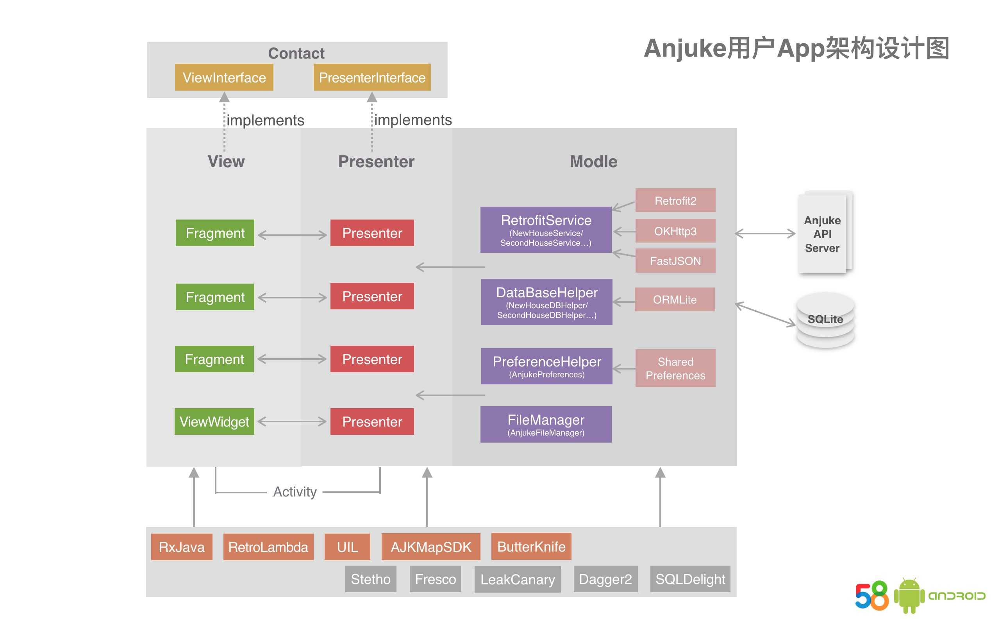
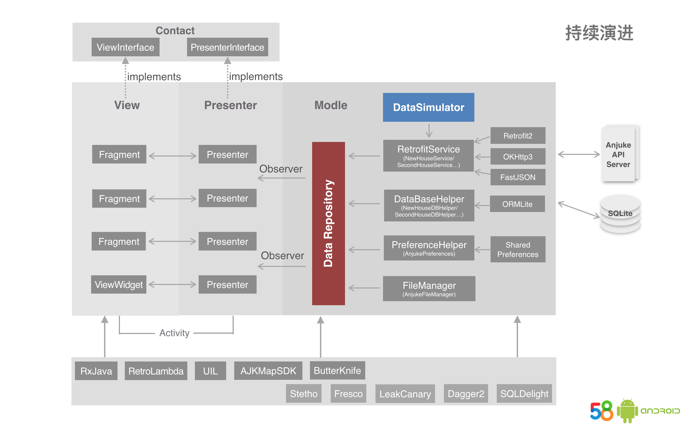

# MinimalistWeather（待完善）

## 一、简介

**MinimalistWeather是Android平台上一款开源天气App，目前还在开发中。项目基于MVP架构，采用时下各主流开源库实现。开发此项目主要是为展示各种开源库的使用方式以及Android项目的架构方案，并作为团队项目开发规范的一部分。**

采用的开源库主要包括：

* RxJava
* Retrofit2
* OKHttp3
* ORMLite
* Dragger2
* ButterKnife
* RetroLambda
* Stetho

**从这个项目中你能学到什么？**

* MVP在实际项目中的应用；
* 时下热门的各种开源框架的使用方法；
* Java8 Lambda表达式和Stream API的用法；
* 怎样适配Material Design；
* ToolBar、RecycleView、CardView、CoordinatorLayout等新控件的用法；
* Gradle的基本配置（包括签名打包、项目依赖等等）；
* 如何更好的管理Gradle依赖库的版本；
* 代码混淆配置；
* 怎样快速开发架构一款Android App。

## 二、项目架构设计图

##### 初始版

##### 演进版

## 三、项目目录结构介绍

