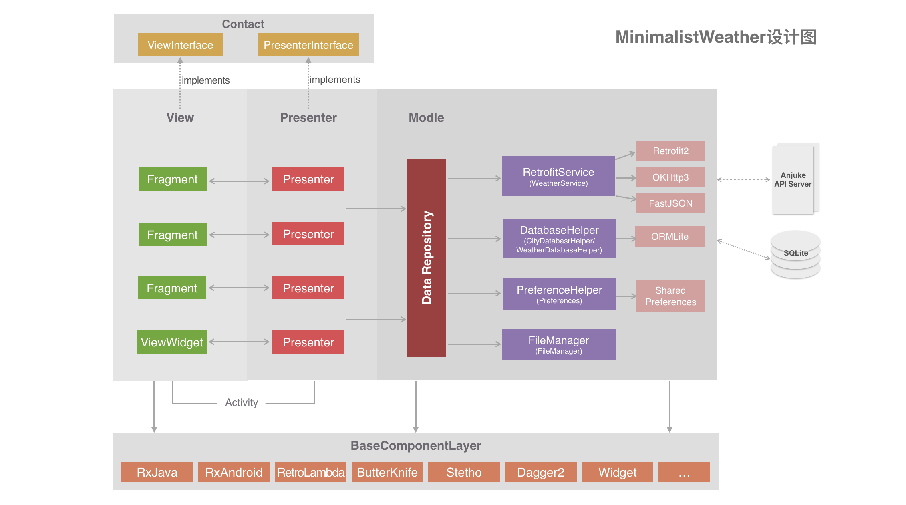

# MinimalistWeather

> 欢迎关注微信公众号：**BaronTalk**


## 一. 前言

推荐阅读：

* [安居客 Android 项目架构演进](https://mp.weixin.qq.com/s?__biz=MzU4ODM2MjczNA==&mid=2247483731&idx=1&sn=76bd5612ba723171b6ebac69aaf039f8&chksm=fddca7d2caab2ec4eec8736cf4005615c401984e2218a0cfc71dddfe3a204495c4e8a7312b4a&scene=38#wechat_redirect)
* [Android 模块化探索与实践](https://mp.weixin.qq.com/s?__biz=MzU4ODM2MjczNA==&mid=2247483732&idx=1&sn=b7ee1151b2c8ad2e997b8db39adf3267&chksm=fddca7d5caab2ec33905cc3350f31c0c98794774b0d04a01845565e3989b1f20205c7f432cb9&scene=38#wechat_redirect)

**MinimalistWeather 是 Android 平台上一款开源天气 App ，目前还在开发中。项目基于 MVP 架构，采用各主流开源库实现。开发此项目主要是为展示各种开源库的使用方式以及 Android 项目的设计方案，并作为团队项目开发规范的一部分。**

采用的开源库包括：

* RxJava
* Retrofit2
* OKHttp3
* ORMLite
* Dagger2
* ButterKnife
* RetroLambda
* Stetho

**本项目还展示了：**

* MVP+RxJava在实际项目中的应用，MVP中RxJava生命周期的管理...；
* 上述罗列的各种开源框架的使用方法；
* Java8 Lambda表达式和Stream API的用法；
* 怎样适配Material Design；
* ToolBar、RecycleView、CardView、CoordinatorLayout等新控件的用法；
* Gradle的基本配置（包括签名打包、项目依赖等等）；
* 如何更好的管理Gradle依赖库的版本；
* 代码混淆配置；
* 如何快速开发一款结构清晰、可扩展性强的Android Application。

## 二. 项目结构设计图



## 三. 项目包结构介绍

**App Module包结构**

```Java
-com.baronzhang.android.weather
    + base	  // MVP 各组件的基类及相关基础类
    + data    // MVP 中所有 Model 层的数据处理都在这里
    - feature       // 业务 feature，feature 内按页面划分，如果是大型项目可以按业务模块划分，对于特大型项目建议走模块化（组件化）方案，每个业务模块再按照 MinimalistWeather 的分包规则来分包
        + home
        - selectcity
            - xxActivity.java // Activity 作为全局的控制者，用来负责创建 View 和 Presenter 的实例
            - xxFragment.java 
            - xxPresenter.java
            - xxContract.java // 契约类，用来统一管理 View 和 Presenter 的接口
    + util
    - AppConstants.java        // App 全局常量
    - WeatherApplication.java  // Application 类
    - WelcomeActivity.java     // 放在这里是为了便于查找应用程序入口
```

**欢迎扫码关注公众号交流**


## 三. 开源许可 [](https://www.apache.org/licenses/LICENSE-2.0)

```
Copyright 2017 Baron Zhang

Licensed under the Apache License, Version 2.0 (the "License");
you may not use this file except in compliance with the License.
You may obtain a copy of the License at

   http://www.apache.org/licenses/LICENSE-2.0

Unless required by applicable law or agreed to in writing, software
distributed under the License is distributed on an "AS IS" BASIS,
WITHOUT WARRANTIES OR CONDITIONS OF ANY KIND, either express or implied.
See the License for the specific language governing permissions and
limitations under the License.
```

